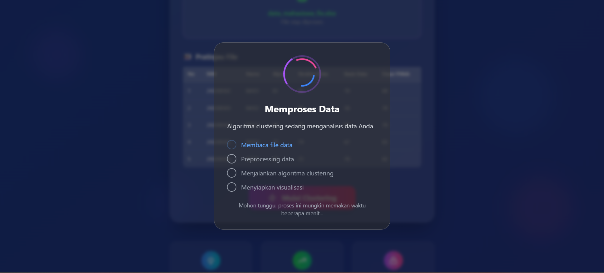

# Aplikasi Clustering Data Mahasiswa

Selamat datang di project Aplikasi Clustering Data Mahasiswa! Ini adalah sebuah aplikasi web yang dibangun menggunakan **Flask** dan **Tailwind CSS** untuk melakukan analisis clustering pada data mahasiswa. Tujuan dari aplikasi ini adalah untuk mengelompokkan mahasiswa ke dalam beberapa cluster berdasarkan atribut tertentu, sehingga dapat ditemukan pola atau wawasan yang berguna.

## Tampilan Aplikasi

Berikut adalah tampilan aplikasi saat sedang memproses data clustering:


*(Catatan: Pastikan Anda sudah meletakkan gambar `image_90b5a8.png` di dalam folder `assets` di root project Anda)*

---

## 🚀 Teknologi yang Digunakan

* **Backend**: Python, Flask
* **Frontend**: HTML, Tailwind CSS
* **Library Python**:
    * Pandas (untuk manipulasi data)
    * Scikit-learn (untuk algoritma clustering)
    * *Tambahkan library lain yang Anda gunakan di sini*

---

## ✨ Fitur Utama

* **Autentikasi Pengguna**: Sistem registrasi dan login untuk pengguna.
* **Upload File**: Pengguna dapat mengunggah dataset mahasiswa dalam format `.csv`.
* **Proses Clustering**: Menjalankan algoritma clustering (misalnya K-Means) secara otomatis.
* **Visualisasi Hasil**: Menampilkan hasil clustering dalam bentuk tabel dan visualisasi (grafik/plot).
* **Riwayat Analisis**: Melihat kembali hasil-hasil analisis yang pernah dilakukan.

---

## ⚙️ Instalasi dan Cara Menjalankan

Ikuti langkah-langkah berikut untuk menjalankan project ini di lingkungan lokal Anda.

**1. Clone Repository**
```bash
git clone [URL_REPOSITORY_ANDA]
cd [NAMA_FOLDER_PROJECT]